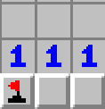
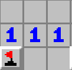
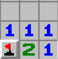

# MineSweeper OOP

Classic game of minesweeper, played from the console terminal.

Rules of Minesweeper:

Menu navigation: <kbd>W A S D</kbd> or <kbd> &#8593; &#8595; &#8592; &#8594;</kbd> and <kbd>SPACE</kbd> or <kbd>ENTER</kbd>

The goal is to find all the mines
<kbd>left click</kbd> reveals a cell
<kbd>right click</kbd> flags/unflags a cell

If you flag all the cells that a number can have (and press the cell) it will reveal all the cells not marked with a flag

 <kbd>&#8594</kbd>  <kbd>&#8594</kbd> 

## Resurse

- [SFML](https://github.com/SFML/SFML/tree/aa82ea132b9296a31922772027ad5d14c1fa381b) (Zlib)
- [Assets spreadSheet](https://github.com/didii/MineSweeper.Unity/blob/master/Assets/Spritesheets/MinesweeperSpritesheet.png)
- [Rest of images and structures](https://minesweeper.online/) (with Inspect Element)